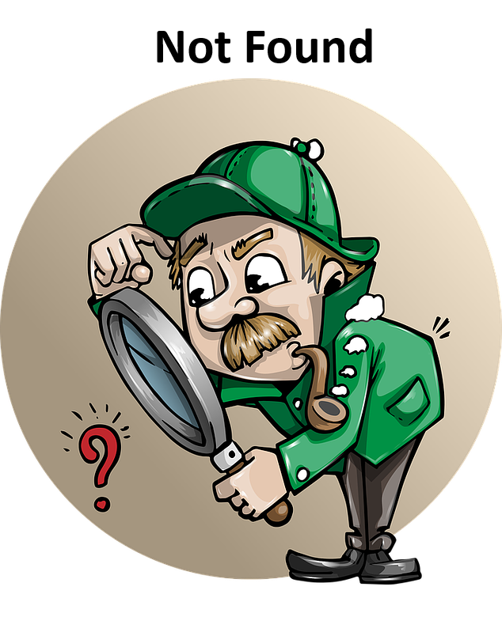

Este es un proyecto hecho con [Next.js](https://nextjs.org/) iniciado con [`create-next-app`](https://github.com/vercel/next.js/tree/canary/packages/create-next-app).

# MovieApp

Aquí podrás buscar tu película o serie favorita, donde podrás ver el póster, título y año en que se realizó la película.

## Tabla de Contenidos

-   [Instalación](#instalación)
-   [Uso](#uso)
-   [Ejemplos](#ejemplos)
-   [Contribución](#contribución)

## Instalación

1. Clona este repositorio: `git clone https://github.com/tuusuario/tuproyecto.git`
2. Navega al directorio del proyecto: `cd tuproyecto`
3. Instala las dependencias: `npm install`
4. Configura las variables de entorno según sea necesario (solo es la api key que proporciona OMDB).

## Uso

Comando para iniciar con el servidor

```bash
npm run dev
```

`````markdown
## Ejemplos



### Búsqueda de Películas

````jsx
<SearchBar onSearchSubmit={handleSearch} />
<MovieList searchQuery={searchQuery} />

```markdown
## Contribución

¡Gracias por considerar contribuir a este proyecto! Para contribuir, sigue estos pasos:

1. Haz un fork del repositorio y clónalo localmente.
2. Crea una nueva rama para tu contribución: `git checkout -b mi-contribucion`
3. Haz tus cambios y asegúrate de que las pruebas pasen.
4. Envía tu solicitud de extracción (pull request) explicando tus cambios.


## Contacto

Puedes encontrarme en LinkedIn para cualquier consulta adicional:
[LinkedIn](https://www.linkedin.com/in/tuusuario/)

También puedes visitar mi perfil de GitHub para ver más proyectos:
[GitHub](https://github.com/tuusuario/)
````
`````

```

```
